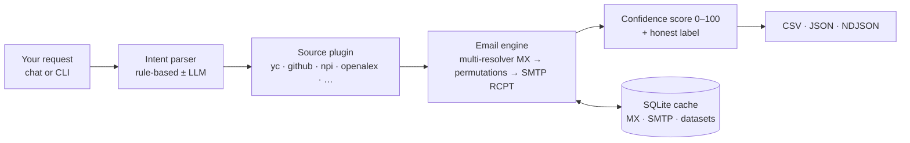

<div align="center">

# 🧲 OpenLeads

### The free, open-source Apollo alternative — for *everyone*.

**Find founders, developers, doctors, researchers — anyone — and verify their emails, using only free, public data. No paid APIs. No API keys. No seat fees. Now with an interactive chat CLI.**

[](./LICENSE)
[](https://www.python.org/)
[](#-how-it-works)
[](https://pypi.org/project/openleads/)
[](https://github.com/Samyrrrrrr990/openleads/actions/workflows/ci.yml)
[](./CONTRIBUTING.md)
[](https://github.com/Samyrrrrrr990/openleads/stargazers)

</div>

---

Apollo, Hunter, RocketReach, and ZoomInfo all sell the same two things: **a contact database** and **email verification**. Their moat is the database. **OpenLeads inverts it.**

> OpenLeads is a **universal `entity → verified email` engine**, fed by a registry of **pluggable, free, keyless public data sources.**

The email engine doesn't care *who* you're looking for. So coverage grows by adding small **source plugins**, not by paying for a database. v2.0 ships sources for **startup founders, open-source developers, U.S. doctors, and academic researchers** — and you can add any vertical (lawyers, podcasters, real-estate agents…) by dropping a single `.py` file in a folder.

All for **$0**, in code you can read in one sitting.

```text
openleads> find 25 AI founders, verified emails only
  plan  source=yc  count=25  filter=AI  verified-only  parser=rule
  ┏━━━┳━━━━┳━━━━━━━━━━━━━━━━━┳━━━━━━━━━━━━━━┳━━━━━━━━━┳━━━━━━━━━┳━━━━━━━┓
  ┃ # ┃ ✓  ┃ Email           ┃ Name         ┃ Title   ┃ Org     ┃ Score ┃
  ┡━━━╇━━━━╇━━━━━━━━━━━━━━━━━╇━━━━━━━━━━━━━━╇━━━━━━━━━╇━━━━━━━━━╇━━━━━━━┩
  │ 1 │ OK │ ada@acme.ai     │ Ada Lovelace │ Founder │ Acme    │  96   │
  │ 2 │ ~CA│ grace@cobol.dev │ Grace Hopper │ CEO     │ COBOLwx │  71   │
  └───┴────┴─────────────────┴──────────────┴─────────┴─────────┴───────┘
  25 leads · 18 verified · /export FILE to save
```

> `OK` = SMTP-verified · `~CA` = catch-all best-guess · `~PG` = MX-only pattern guess · **Score** = 0–100 confidence

---

## ✨ Why OpenLeads

| | OpenLeads | Apollo / Hunter (free tier) |
| --- | --- | --- |
| **Cost** | $0, forever | Credit-limited, then paid |
| **API key required** | ❌ None | ✅ Required |
| **Who you can find** | Founders, devs, doctors, researchers, **+ any vertical you plug in** | Their database only |
| **Email verification** | ✅ Live SMTP `RCPT` + 0–100 score | Paid feature |
| **Catch-all detection** | ✅ Yes | Sometimes |
| **Interactive chat CLI** | ✅ Yes (`openleads chat`) | ❌ |
| **You own the code** | ✅ Readable, hackable, extensible | ❌ Black box |
| **Output** | ✅ CSV / JSON / NDJSON | Often gated |
| **Core dependencies** | **Zero** (stdlib only) | — |

## 🚀 Install

```bash
# Python (recommended) — zero-dependency engine + plain CLI
pip install openleads

# …with the pretty interactive chat TUI
pip install "openleads[chat]"

# …with the cold-email companion too
pip install "openleads[all]"
```

Prefer Node? A thin wrapper lets you run it with **npx** (it installs the Python package on first use):

```bash
npx openleads find "50 fintech founders verified only"
# or: npm i -g openleads
```

## ⚡ Quickstart

```bash
# Launch the interactive chat — just type what you want
openleads

# Or go one-shot, non-interactive:
openleads find "50 fintech founders, verified only" --out leads.csv
openleads find --source npi --keyword pediatric --location CA --format json
openleads find "rust developers in Berlin" --source github --format ndjson --out devs.ndjson

# Verify specific addresses
openleads verify ada@acme.io grace@cobol.dev

# See what you can search
openleads sources
```

No signup, no key, no database fees.

## 💬 The chat CLI

`openleads chat` (or just `openleads`) opens a Claude-Code-style REPL. Type requests in plain English and refine conversationally:

```text
openleads> pediatricians in California
openleads> only verified
openleads> /source github
openleads> machine learning researchers as ndjson
openleads> /export leads.ndjson
```

- **Works fully offline.** A rule-based intent parser understands counts, verticals, locations, filters, and `verified only` — **no API key needed.**
- **Optionally smarter.** Set `OPENROUTER_API_KEY` (a free model works) and free-form input is parsed by an LLM. The active mode is always shown.
- **Slash commands** for precision: `/source`, `/count`, `/verified`, `/format`, `/export`, `/sources`, `/cache`, `/help`, `/quit`.

## 🧩 Sources (and adding your own)

```bash
$ openleads sources
  github       [people ] developers & open-source orgs
  npi          [people ] U.S. doctors & healthcare providers
  openalex     [people ] researchers & academics
  producthunt  [company] trending products & startups
  yc           [company] startup founders (Y Combinator)
```

All are **keyless and free**. Want a vertical we don't ship — recruiters, lawyers, real-estate agents, your CRM export? Drop a `*.py` file in `~/.openleads/sources/`:

```python
from openleads.sources.base import Source
from openleads.models import Entity, Query

class LawyersSource(Source):
    name = "lawyers"
    kind = "people"
    vertical = "attorneys"
    description = "State bar directory."

    def search(self, query: Query):
        for row in fetch_from_some_free_directory(query):
            yield Entity(full_name=row["name"], organization=row["firm"],
                         domain=row["firm_domain"], source=self.name)
```

Run `openleads sources` and it's there. The email engine handles the rest. Full guide: [`docs/sources.md`](./docs/sources.md).

## 📦 Output formats

```bash
openleads find "20 founders" --format csv     # default; CRM/mail-merge ready
openleads find "20 founders" --format json    # array, includes score + signals
openleads find "20 founders" --format ndjson  # one lead per line, streamable
openleads find "20 founders" --format json --out -   # write to stdout
```

The CSV schema is a superset of v1's, so the cold-email companion and any existing tooling keep working.

## 🔍 How it works



The crown jewel is the **email engine** ([deep dive](./docs/how-it-works.md)): MX cross-checked across **two DNS-over-HTTPS resolvers**, common name permutations, and a real SMTP `RCPT` probe (no message is ever sent) with **catch-all detection**. Results carry an explainable **0–100 score**. A **SQLite cache** avoids re-probing domains and mail servers between runs.

> 📡 SMTP verification needs outbound **port 25**. Works on most servers; some home ISPs block it, in which case OpenLeads gracefully falls back to MX-validated pattern guesses.

## 📨 Bonus: cold-email companion

`openleads campaign` turns `leads.csv` into personalized outreach — LLM-drafted (free OpenRouter models supported), clean formatting, placeholder guards, sends over **your own** SMTP, and saves a copy to Sent. Dry-run by default; `--live` to send.

```bash
pip install "openleads[campaign]"
cp .env.example .env        # add your SMTP + OpenRouter creds
openleads campaign          # dry run (preview)
openleads campaign --live   # send for real
```

> ⚠️ This is the only part that touches your mailbox. The lead engine never sends anything.

## 🧭 Responsible use

OpenLeads is for legitimate outreach, recruiting, research, and prospecting. Some verticals carry extra weight — e.g. healthcare providers (NPI) and academics — so please read [`docs/responsible-use.md`](./docs/responsible-use.md). **You** are responsible for anti-spam law (CAN-SPAM, GDPR, CASL) and each source's terms.

## 🗺️ What's new in v2.0

- ✅ Installable package + **`openleads` CLI** (pip & npx)
- ✅ **Interactive chat REPL** (rule-based, LLM-optional)
- ✅ **Pluggable sources** + 4 new keyless verticals (GitHub, NPI, OpenAlex, ProductHunt)
- ✅ **Confidence scoring (0–100)** with multi-resolver MX cross-checks
- ✅ **SQLite caching** layer
- ✅ **`--format json/ndjson`** output

See the full [CHANGELOG](./CHANGELOG.md).

## 🤝 Contributing

PRs very welcome — see [CONTRIBUTING.md](./CONTRIBUTING.md). The easiest high-impact contribution is **a new source plugin** ([guide](./docs/sources.md)) — that's literally how OpenLeads becomes "Apollo for everyone."

## 📄 License

[PolyForm Noncommercial 1.0.0](./LICENSE) — free for personal, research, educational, and nonprofit use. Commercial use? See [COMMERCIAL-LICENSE.md](./COMMERCIAL-LICENSE.md).

## 🙏 Acknowledgements

[`yc-oss/api`](https://github.com/yc-oss/api) · [OpenAlex](https://openalex.org) · [NPI Registry](https://npiregistry.cms.hhs.gov/) · GitHub & ProductHunt public data · and everyone who has ever rage-quit a "request a demo" button.

<div align="center">

**If OpenLeads saved you a subscription, consider leaving a ⭐ — it genuinely helps.**

</div>
