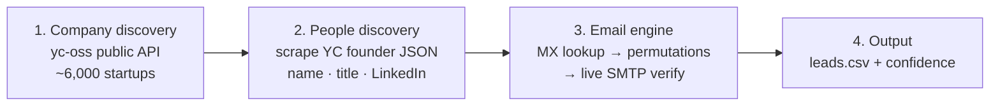

<div align="center">

# 🧲 OpenLeads

### The free, open-source Apollo alternative.
**Find tech founders & executives, then verify their emails — using only free, public data. No paid APIs. No API keys. No seat fees.**

[](./LICENSE)
[](https://www.python.org/)
[](#-how-it-works)
[](https://github.com/Samyrrrrrr990/openleads/actions/workflows/ci.yml)
[](./CONTRIBUTING.md)
[](https://github.com/Samyrrrrrr990/openleads/stargazers)

</div>

---

Apollo, Hunter, RocketReach, and ZoomInfo all charge for the same two things: **finding decision-makers** and **finding their email**. OpenLeads does both with code you can read in one sitting and run for **$0**.

It discovers real founders from a public database of ~6,000 YC-backed startups, pulls their names and titles, generates likely email addresses, and then **actually verifies them over SMTP** — the same trick the paid tools gate behind a credit card.

```
[ 1/20] OK  ada@acme.io                 Ada Lovelace (Founder) @ Acme
[ 2/20] OK  alan.turing@enigma.dev      Alan Turing (Founder) @ Enigma Labs
[ 3/20] ~CA grace.hopper@cobolworks.com Grace Hopper (Founder/CEO) @ COBOLworks
[ 8/20] OK  katherine@orbital.space     Katherine Johnson (Founder) @ Orbital
...
[summary] confidence: {'verified': 10, 'catch_all_guess': 9, 'pattern_guess': 1}
[output] wrote 20 leads -> leads.csv
```

> `OK` = SMTP-verified deliverable · `~CA` = catch-all best-guess · `~PG` = pattern guess

---

## ✨ Why OpenLeads

| | OpenLeads | Apollo / Hunter (free tier) |
| --- | --- | --- |
| **Cost** | $0, forever | Credit-limited, then paid |
| **API key required** | ❌ None | ✅ Required |
| **Monthly cap** | None (be polite) | 25–50 lookups |
| **Email verification** | ✅ Live SMTP `RCPT` check | Paid feature |
| **Catch-all detection** | ✅ Yes | Sometimes |
| **You own the code** | ✅ MIT-readable, hackable | ❌ Black box |
| **Export** | ✅ Plain CSV | Often gated |
| **Core dependencies** | **Zero** (stdlib only) | — |

## 🚀 Quickstart

```bash
git clone https://github.com/Samyrrrrrr990/openleads.git
cd openleads

# The core engine needs NOTHING installed. Just run it:
python3 lead_engine.py --count 20

# -> writes leads.csv with 20 founders + verified emails
```

That's it. No signup, no key, no `pip install` for the engine itself.

## 🛠️ Usage

```bash
python3 lead_engine.py [options]

  --count N            How many leads to build (default: 20)
  --industry TEXT      Filter by YC industry/tag (e.g. "fintech", "B2B", "AI")
  --max-companies N    Scan budget (default: 400)
  --verified-only      Drop pattern/catch-all guesses; keep only SMTP-verified
  --no-write           Print results without touching leads.csv
  --out PATH           Output file (default: leads.csv)
```

**Examples**

```bash
# 50 fintech founders, only rock-solid verified emails
python3 lead_engine.py --count 50 --industry fintech --verified-only

# Preview AI founders without writing a file
python3 lead_engine.py --industry "artificial intelligence" --no-write
```

### Output schema

`leads.csv` is plain CSV, ready for any CRM or mail-merge:

| Column | Example |
| --- | --- |
| First Name / Last Name | `Ada` / `Lovelace` |
| Email | `ada@acme.io` |
| Title | `Founder` |
| Organization Name | `Acme` |
| Industry / # Employees | `B2B` / `2` |
| City / Country | `San Francisco` / `USA` |
| LinkedIn Url | `https://...` |
| **Email Confidence** | `verified` · `catch_all_guess` · `pattern_guess` |

See [`data/sample_leads.csv`](./data/sample_leads.csv) for a full example.

## 🔍 How it works

OpenLeads is a four-stage pipeline. Every stage uses a free, public source.



1. **Company discovery** — pulls the [`yc-oss`](https://github.com/yc-oss/api) public API: thousands of YC companies with website, industry, size, and location. No key, no rate limit.
2. **People discovery** — reads each company's public YC page and extracts founders (name, title, LinkedIn) from the embedded JSON.
3. **Email engine** — the special sauce ([deep dive](./docs/how-it-works.md)):
   - **MX lookup** via Google DNS-over-HTTPS — confirms the domain can receive mail.
   - **Permutation** — generates the common patterns (`first@`, `first.last@`, `flast@`, …).
   - **SMTP verification** — opens a real SMTP conversation, issues `RCPT TO`, and reads the server's reply **without ever sending a message**. A `250` means the mailbox exists. It also probes a random address first to **detect catch-all domains** so guesses are labeled honestly.
4. **Output** — writes a clean CSV with a confidence label on every row.

> 📡 SMTP verification needs outbound **port 25**. It works on most machines and servers; some home ISPs block it, in which case OpenLeads gracefully falls back to MX-validated pattern guesses.

## 📨 Bonus: cold-email campaign companion

The repo includes [`automation.py`](./automation.py) — an optional, batteries-included outreach tool that turns `leads.csv` into personalized cold emails:

- Drafts hyper-personalized copy with an LLM (via OpenRouter, free models supported)
- Enforces clean formatting (`Hey {name},` + spacing), strips placeholders, normalizes Unicode
- Sends over your own SMTP and **saves a copy to your Sent folder** via IMAP
- Dry-run by default; `--live` to actually send

```bash
cp .env.example .env        # add your SMTP + OpenRouter creds
pip install -r requirements.txt
python3 automation.py            # dry run (preview)
python3 automation.py --live     # send for real
```

> ⚠️ **This is the only part that touches paid-optional services and your mailbox.** The core lead engine never sends anything.

## 🧭 Responsible use

OpenLeads is built for legitimate B2B outreach, recruiting, research, and sponsorship prospecting. Email verification queries are lightweight and rate-limited to be polite to mail servers. **You are responsible** for complying with anti-spam law (CAN-SPAM, GDPR, CASL) and each source's terms. Please read [`docs/responsible-use.md`](./docs/responsible-use.md) before running campaigns.

## 🗺️ Roadmap

- [ ] Additional free company sources (GitHub orgs, ProductHunt, public registries)
- [ ] Pluggable people sources beyond YC
- [ ] Confidence scoring with multiple MX cross-checks
- [ ] Optional caching layer to avoid re-probing domains
- [ ] `--format json/ndjson` output
- [ ] Small web UI

Want one of these? [Open an issue](https://github.com/Samyrrrrrr990/openleads/issues) or send a PR.

## 🤝 Contributing

PRs are very welcome — see [CONTRIBUTING.md](./CONTRIBUTING.md). Good first issues are labeled [`good first issue`](https://github.com/Samyrrrrrr990/openleads/labels/good%20first%20issue).

## 📄 License

[PolyForm Noncommercial 1.0.0](./LICENSE) — free for personal, research, educational, and **nonprofit** use. Using it commercially? See [COMMERCIAL-LICENSE.md](./COMMERCIAL-LICENSE.md); it's cheap and friendly.

## 🙏 Acknowledgements

- [`yc-oss/api`](https://github.com/yc-oss/api) for the open YC company dataset
- Everyone who has ever rage-quit a "request a demo" button

<div align="center">

**If OpenLeads saved you a $99/mo subscription, consider leaving a ⭐ — it genuinely helps.**

</div>
