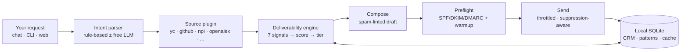

<div align="center">

# 🧲 OpenLeads

### Apollo for everyone. For **$0**.

**Find founders, developers, doctors, researchers — anyone — verify their email *deliverably*, write the cold email, and send it. Free, open source, keyless, and entirely on your machine.**

[](./LICENSE)
[](https://www.python.org/)
[](#-how-it-works)
[](https://pypi.org/project/openleads/)
[](https://github.com/Samyrrrrrr990/openleads/actions/workflows/ci.yml)
[](./CONTRIBUTING.md)
[](https://github.com/Samyrrrrrr990/openleads/stargazers)

</div>

---

Apollo, Hunter, RocketReach, and ZoomInfo sell the same two things: **a contact database** and **email verification** — then upsell you the sending. **OpenLeads is the whole stack, inverted and free.**

> A universal **`entity → verified email → cold email → sent`** machine, fed by a registry of **pluggable, keyless, public data sources** — running **entirely on your laptop**.

**v3 is the ultimate update.** v2 found and verified leads. v3 closes the loop: it **writes** the email and **sends** it, behind a deliverability engine that **beats Hunter & Apollo's free tier** — all for **$0**, with a **zero-dependency core**, and **no data ever leaving your machine.**

```text
$ openleads run "50 AI founders in SF, verified only" --live
  [engine] source=yc — searching…
   safe   ada@acme.ai        Ada Lovelace · Founder · 96
   safe   grace@cobol.dev    Grace Hopper · CEO     · 91
   risky  j.doe@stealth.io   J. Doe       · —       · 58   (held back)
  [engine] done — 41 safe · 9 risky
  [write]  drafting 41 personalized emails…
  [outbox] sender grade A · warmup day 6 · 40/day
   sent   → ada@acme.ai   «quick idea re: your launch»
  → 40 sent · 1 held (cap) · 0 bounced
```

---

## ✨ The four clicks

The painful multi-tool workflow — scrape in A, verify in B, enrich in C, load into sender D, warm up in E — collapses into **one local app + CLI**:

| | | |
|---|---|---|
| **1 · Find** | Describe who you want in plain English. | Keyless public sources → resolved emails. |
| **2 · Write** | Personalized, spam-linted, plain-text drafts. | Free LLM or sharp template — edit anything. |
| **3 · Connect** | One-time mailbox setup with provider presets. | A preflight grades your SPF/DKIM/DMARC. |
| **4 · Send** | Throttled, warmup-capped, suppression-aware. | One-click unsubscribe headers. No tracking pixels. |

Do it in the terminal (`openleads run …`), in the chat REPL (`openleads`), or in the **local web dashboard** (`openleads web`).

## 🖥️ The local dashboard

```bash
openleads web   # opens http://127.0.0.1:8787 — no Node, no build, no cloud
```

A hand-built single-page app served by a stdlib HTTP server bound to localhost. Find, Leads, Compose, Send, CRM, Settings, and Doctor — with the four-click path front and centre and results **streaming in live**. Black-and-white with hints of red, reduced-motion aware, and **nothing leaves your machine**. See [`docs/web.md`](./docs/web.md).

## 📡 Why the emails actually land

Most free finders verify with a single SMTP `RCPT` probe over outbound **port 25** — which home ISPs and most clouds **block**. When it's blocked, every address silently degrades to a `first.last@domain` guess and your campaign bounces. That was v2's #1 failure.

v3 cross-checks **seven independent signals** — most needing **no port 25 at all** — then gates honestly into three tiers so you only send what's likely to land:

| Signal | Needs port 25? |
|---|---|
| **MX consensus** — two DoH resolvers must agree | no |
| **SPF · DMARC · provider class** — TXT lookups | no |
| **Disposable / role / free-provider** — static lists | no |
| **Gravatar existence** — md5 → 200/404 | no |
| **Ground-truth harvest** — real emails from GitHub commits, `mailto:`, `security.txt` | no |
| **Learned domain patterns** — compound across every run | no |
| **SMTP `RCPT` + catch-all double-probe** | yes (graceful when blocked) |

→ **`safe`** (send it) · **`risky`** (kept, held back by default) · **`bad`** (dropped). Every lead carries an explainable 0–100 score and a `reasons[]` list. Deep dive: [`docs/deliverability.md`](./docs/deliverability.md).

## 🆚 vs. the free tiers

| | OpenLeads | Apollo / Hunter (free) |
| --- | --- | --- |
| **Cost** | $0, forever | credit-limited, then paid |
| **API key required** | ❌ none | ✅ required |
| **Who you can find** | founders, devs, doctors, researchers **+ any vertical you plug in** | their database only |
| **Email verification** | ✅ 7-signal consensus + 0–100 score | paid feature |
| **Writes the email** | ✅ free LLM or template | ❌ / upsell |
| **Sends it for you** | ✅ warmup, throttle, suppression | upsell |
| **Where it runs** | 🔒 your machine, no data leaves | their cloud |
| **You own the code** | ✅ readable, hackable | ❌ black box |
| **Core dependencies** | **zero** (stdlib only) | — |

## 🚀 Install

```bash
# Python (recommended) — zero-dependency engine + the full local app
pip install "openleads[all]"

# minimal: just the engine + plain CLI
pip install openleads
```

Prefer Node? A thin wrapper runs it via **npx** (it installs the Python package on first use):

```bash
npx openleads find "50 fintech founders verified only"
# or: npm i -g openleads
```

**Try it in 10 seconds:**

```bash
pip install "openleads[all]"
openleads doctor     # check your finding + sending setup
openleads web        # launch the local dashboard
# …or stay in the terminal:
openleads            # the interactive chat — just type what you want
```

`openleads --version` should print `openleads 3.0.0`. Full walkthrough: [`docs/quickstart.md`](./docs/quickstart.md).

## ⚡ Commands

```bash
# find + verify (deliverable only)
openleads find "50 fintech founders, verified only" --out leads.csv
openleads find --source npi --keyword pediatric --location CA --format json

# the whole pipeline: find → write → send (dry-run unless --live)
openleads run "rust developers in Berlin"
openleads run "20 SaaS founders" --live

# pieces of it
openleads write "10 AI founders" -o drafts.json   # just draft
openleads send  "10 AI founders" --live           # find → write → send
openleads verify ada@acme.io grace@cobol.dev      # verify concrete addresses

# manage
openleads sources          # what you can search
openleads crm              # your local CRM (leads + touches + status)
openleads config           # set keys, mailbox, sender identity, send limits
openleads doctor           # health-check finding + sending
openleads inbox            # scan IMAP for replies & bounces (optional)
```

Sending is **dry-run by default** everywhere — add `--live` to actually send. The finder never touches your mailbox.

## 💬 The chat CLI

`openleads chat` (or just `openleads`) opens a Claude-Code-style REPL. Type in plain English and refine conversationally — now with `/write` and `/send` too:

```text
openleads> pediatricians in California, verified only
openleads> /source github
openleads> machine learning researchers as ndjson
openleads> /write          # draft emails for the safe leads
openleads> /send --live    # send them (with a confirm)
```

Works **fully offline** via a rule-based parser (no key needed). Set `OPENROUTER_API_KEY` (a free model works) to upgrade free-form parsing and AI drafting.

## 🧩 Sources (and adding your own)

```text
$ openleads sources
  github       [people ] developers & open-source orgs
  npi          [people ] U.S. doctors & healthcare providers
  openalex     [people ] researchers & academics
  producthunt  [company] trending products & startups
  yc           [company] startup founders (Y Combinator)
```

All **keyless and free**. Want a vertical we don't ship — recruiters, lawyers, real-estate agents, your CRM export? Drop a `*.py` file in `~/.openleads/sources/`:

```python
from openleads.sources.base import Source
from openleads.models import Entity, Query

class LawyersSource(Source):
    name, kind, vertical = "lawyers", "people", "attorneys"
    description = "State bar directory."

    def search(self, query: Query):
        for row in fetch_from_some_free_directory(query):
            yield Entity(full_name=row["name"], organization=row["firm"],
                         domain=row["firm_domain"], source=self.name)
```

Run `openleads sources` and it's there. The email engine handles the rest. Guide: [`docs/sources.md`](./docs/sources.md).

## 🔒 Local-first by design

No hosted backend. No accounts. No tracking. Your leads, drafts, mailbox credentials, learned patterns, and CRM all live in a local SQLite file under `~/.openleads`. The engine talks **only** to public data sources and **your** mail server. Secrets are stored `chmod 600` and never sent back to the browser.

## 🔍 How it works



Same path is invoked by the CLI, the chat REPL, and the web dashboard. Architecture: [`docs/architecture.md`](./docs/architecture.md).

## 🧭 Responsible use

OpenLeads is for legitimate outreach, recruiting, research, and prospecting. Some verticals carry extra weight — healthcare providers (NPI), academics — so please read [`docs/responsible-use.md`](./docs/responsible-use.md). **You** are responsible for anti-spam law (CAN-SPAM, GDPR, CASL) and each source's terms. v3 ships the guardrails (suppression, one-click unsubscribe, warmup caps, dry-run defaults); using them well is on you.

## 🗺️ What's new in v3.0

- ✅ **Multi-signal deliverability engine** — 7 signals, mostly no port 25, honest `safe/risky/bad` tiers
- ✅ **Writes + sends** — drafting, provider presets, preflight, warmup, suppression, follow-ups
- ✅ **`openleads run`** — find → verify → write → send in one command
- ✅ **Local web dashboard** (`openleads web`) — no Node, no cloud
- ✅ **In-app config + `doctor`** — no dotfile editing
- ✅ **Local CRM**, dedupe, learned patterns that compound across runs

See the full [CHANGELOG](./CHANGELOG.md).

## 🤝 Contributing

PRs very welcome — see [CONTRIBUTING.md](./CONTRIBUTING.md). The highest-impact contribution is **a new source plugin** ([guide](./docs/sources.md)) — that's literally how OpenLeads becomes "Apollo for everyone."

## 📄 License

[PolyForm Noncommercial 1.0.0](./LICENSE) — free for personal, research, educational, and nonprofit use. Commercial use? See [COMMERCIAL-LICENSE.md](./COMMERCIAL-LICENSE.md).

## 🙏 Acknowledgements

[`yc-oss/api`](https://github.com/yc-oss/api) · [OpenAlex](https://openalex.org) · [NPI Registry](https://npiregistry.cms.hhs.gov/) · GitHub & ProductHunt public data · Gravatar · and everyone who has ever rage-quit a "request a demo" button.

<div align="center">

**If OpenLeads saved you a subscription, consider leaving a ⭐ — it genuinely helps.**

</div>
