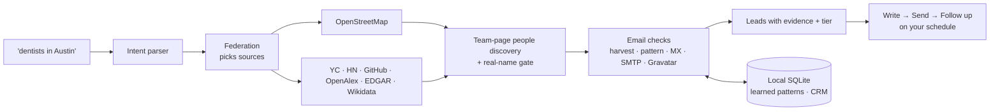

<div align="center">

# 🧲 OpenLeads

### Find people and their work emails from free public data. No API keys. $0.

**Type who you want — _"dentists in Austin"_, _"fintech founders"_, _"law firms in London"_ — and OpenLeads searches OpenStreetMap, Y Combinator, GitHub, OpenAlex, SEC EDGAR, Wikidata and company websites, finds the real people, and tells you honestly which emails are confirmed and which are guesses. Then it can write and send the emails on a schedule. It runs on your machine.**

[](./COMMERCIAL-LICENSE.md)
[](https://pypi.org/project/openleads/)
[](https://www.npmjs.com/package/openleads)
[](https://www.python.org/)
[](#how-it-works)
[](https://github.com/Samyrrrrrr990/openleads/actions/workflows/ci.yml)
[](./BENCHMARK.md)
[](https://github.com/Samyrrrrrr990/openleads/stargazers)

```bash
pipx install openleads        # or: pip install openleads   ·   npx openleads
openleads find "dentists in Austin"
```

</div>

---

```text
$ openleads find "dentists in Austin" -n 6
  ◆ federated search · local …
    1  ▌safe   info@example-dental.com        Example Dental        ▰▰▰▰▰▰▰▰▰▰  98% found
    2  ▌safe   hello@smile-example.com        Smile Example Co      ▰▰▰▰▰▰▰▰▰▰  98% found
    3  ▌risky  maria.lopez@smile-example.com  Maria Lopez           ▰▰▰▰▰▰▱▱▱▱  62% guessed
    4  ▌safe   d.kim@ortho-example.com        Daniel Kim            ▰▰▰▰▰▰▰▰▰▱  88% pattern
  ──────────────────────────────────────────────────────
  6 leads   4 safe deliverable   2 risky unconfirmed   ██████████████████░░░░░░
  4 found or built from a seen pattern · 2 guessed
```
<sub>Output shape from a real run; businesses and people renamed.</sub>

## Why it's different

Apollo, Hunter and ZoomInfo sell a contact database and email verification, then
charge again for sending. OpenLeads does all three for free, from public data, on
your laptop. Two things matter most:

**It's honest about every email.** Most free finders label a `first.last@` guess as
"valid". OpenLeads marks each address:

| Evidence | Meaning |
|---|---|
| **found** | Published on the web, or confirmed by the mail server |
| **pattern** | Built from the format a real address at that company uses |
| **guessed** | A common format, unconfirmed. It's labelled, so you decide |

Those feed a send decision: **safe** (send it), **risky** (held back unless you opt in),
**bad** (dropped). Read [how the scoring works](./docs/deliverability.md).

**It's measured against live data every night.** Unit tests can't tell you whether
"dentists in Austin" returns dentists. [`openleads bench`](./BENCHMARK.md) runs 12 real
queries against the live sources and publishes the results:

<!-- BENCH:START -->
| | v4.0 | **v4.5** |
|---|---:|---:|
| Junk "people" (page headings, org names) | ~30% | **0%** |
| Researcher searches that return anyone | 0 of 1 | **1 of 1** |
| "dentists in Austin" returns dentists | no | **yes** |
<!-- BENCH:END -->

## What you can search

One query fans out across the sources that fit it. You never pick a source, but
`-s name` pins one.

| Ask for | Searched | Example |
|---|---|---|
| Local businesses, any city | OpenStreetMap (Overpass + Nominatim) | `"accountants in Toronto"` |
| Startup founders, companies hiring | Y Combinator, Hacker News | `"AI startup founders"` |
| Companies by industry | Wikidata, SEC EDGAR | `"fintech companies"` |
| Developers | GitHub | `"rust developers in Berlin"` |
| Researchers | OpenAlex | `"machine learning researchers"` |
| Everyone at one company | the company's own site | `"emails at stripe.com"` |
| US healthcare providers | NPI Registry | `"pediatricians"` |

Each company is turned into named people from its team and about pages. Every address
then goes through the email checks: published-address harvest, learned company
pattern, MX/SPF/DMARC, Gravatar, and SMTP where port 25 is open.

Need a source we don't have? A source is [one Python file](./docs/sources.md).

## Use it from Claude, Cursor or Claude Code

OpenLeads is an [MCP server](./docs/mcp.md). Your AI assistant can find and verify
leads mid-conversation:

```bash
claude mcp add openleads -- openleads mcp
```

```json
{ "mcpServers": { "openleads": { "command": "openleads", "args": ["mcp"] } } }
```

> *"Find 10 law firms in London with emails we can actually send to, and draft a two-line intro for each."*

## Put it on a schedule

```bash
openleads recipe add miami "marketing agencies in Miami" --every "weekdays 9am" --send
openleads schedule on     # one agent: launchd · cron · Windows Task Scheduler
openleads runs            # what ran, what it found, what failed
```

Schedules can be plain English (`every 2h`, `mon,thu 14:00`) or cron. Sends stay
inside your daily cap, warmup ramp and business-hour windows, and stop for anyone
who replies. Failed runs send a desktop alert, plus a webhook if you set one.
[Timed runs →](./docs/timed-runs.md)

Rather run it in CI? There's a GitHub Action:

```yaml
- uses: Samyrrrrrr990/openleads@v4.5.0
  with: { query: "marketing agencies in Miami", count: 50 }
```

## Install

```bash
pipx install "openleads[all]"     # recommended
pip install openleads             # minimal: stdlib-only engine + CLI
npx openleads find "…"            # Node: sets up a private Python env on first run
```

```bash
openleads doctor    # checks your setup (DNS, port 25, mailbox)
openleads           # chat: type what you want
openleads web       # local dashboard at http://127.0.0.1:8787
```

Full walkthrough: [docs/quickstart.md](./docs/quickstart.md).

## Commands

```bash
openleads find "50 fintech founders, verified only" -o leads.csv
openleads find "emails at stripe.com"
openleads enrich my-list.csv                   # your names/companies → verified emails
openleads verify ada@acme.io                   # check one address

openleads run "rust developers in Berlin"      # find → write → send (dry-run unless --live)
openleads recipe add NAME "query" --every "…"  # save it, schedule it
openleads watch add NAME "query"               # alert me only on new matches
openleads schedule on | off | status
openleads runs

openleads bench                                # live quality benchmark
openleads mcp                                  # MCP server for AI tools
openleads sources · crm · config · doctor · inbox
```

Sending is a **dry run by default** everywhere. Add `--live` to send.

## How it works


```mermaid
flowchart LR
    Q["'dentists in Austin'"] --> P[Intent parser]
    P --> F[Federation<br/>picks sources]
    F --> S1[OpenStreetMap]
    F --> S2[YC · HN · GitHub · OpenAlex · EDGAR · Wikidata]
    S1 & S2 --> D[Team-page people discovery<br/>+ real-name gate]
    D --> E[Email checks<br/>harvest · pattern · MX · SMTP · Gravatar]
    E --> L[Leads with evidence + tier]
    L --> W[Write → Send → Follow up<br/>on your schedule]
    E <--> DB[(Local SQLite<br/>learned patterns · CRM)]
```

The core is Python standard library only. Everything, including your leads, drafts,
mailbox credentials, learned patterns and CRM, lives in `~/.openleads`. There's no
hosted backend, no account and no telemetry. Details: [docs/architecture.md](./docs/architecture.md).

## Responsible use

OpenLeads is for legitimate prospecting, recruiting and research. You're responsible
for anti-spam law (CAN-SPAM, GDPR, CASL) and each source's terms. It ships the
guardrails: dry-run by default, suppression list, one-click unsubscribe, warmup caps,
no tracking pixels. Read [docs/responsible-use.md](./docs/responsible-use.md).

## License

**Open source under [AGPL-3.0](./LICENSE).** Using OpenLeads is free, including at
your company. If you embed it in a closed-source product, or run a modified version
as a service without publishing your changes, you need a
[commercial license](./COMMERCIAL-LICENSE.md). Releases up to 4.0.1 were PolyForm
Noncommercial.

## Contributing

The highest-impact PR is a new source ([guide](./docs/sources.md)). The second is a
query that `openleads bench` scores badly, along with the fix.
See [CONTRIBUTING.md](./CONTRIBUTING.md).

## Thanks

[OpenStreetMap](https://www.openstreetmap.org/copyright) contributors ·
[OpenAlex](https://openalex.org) · [`yc-oss/api`](https://github.com/yc-oss/api) ·
[NPI Registry](https://npiregistry.cms.hhs.gov/) · SEC EDGAR · Wikidata · Gravatar ·
US Social Security Administration (given-name data).

<div align="center">

**If OpenLeads found you a customer, a ⭐ helps other people find it.**

</div>
