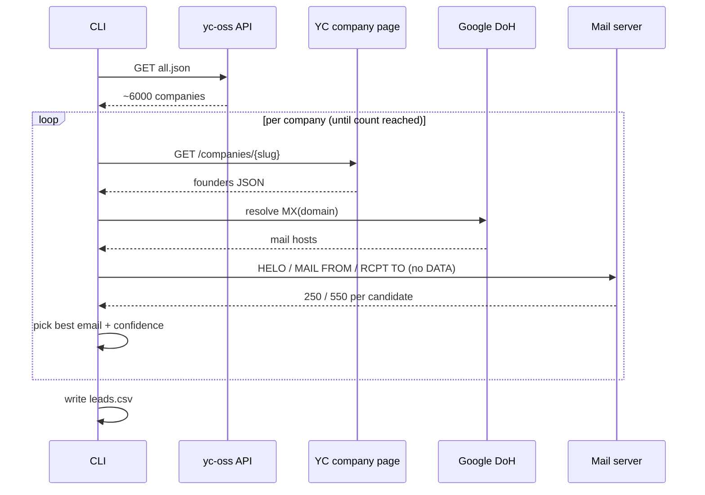

# Architecture

OpenLeads is deliberately small and readable. The whole engine is one file,
`lead_engine.py`, organized into four clearly separated stages.

```
lead_engine.py
├── 1. COMPANY DISCOVERY
│   ├── fetch_companies()         # pull yc-oss all.json
│   └── filter_companies()        # by status, size, website, industry
│
├── 2. PEOPLE DISCOVERY
│   ├── fetch_founders(slug)      # scrape YC page Inertia JSON
│   └── _deep_find()              # walk nested JSON for 'founders'
│
├── 3. EMAIL FINDING ENGINE
│   ├── domain_of(website)        # url -> bare domain
│   ├── mx_hosts(domain)          # DNS-over-HTTPS MX lookup
│   ├── name_parts(full_name)     # -> (first, last)
│   ├── candidate_emails()        # permutation patterns
│   ├── smtp_probe()              # one SMTP convo, RCPT checks, catch-all probe
│   └── find_email()              # orchestrates -> {email, confidence}
│
└── 4. ASSEMBLY + OUTPUT
    ├── split_location()          # "City, Region, Country" -> (city, country)
    ├── pick_exec(founders)       # choose the most senior founder
    ├── lead_row()                # map to CSV schema
    ├── build_leads()             # the main loop
    └── write_csv()               # emit leads.csv
```

## Data flow



## Design principles

1. **Zero dependencies in the core.** Only the Python standard library. Easy to audit,
   trivial to run, nothing to `pip install`.
2. **Each function does one thing.** Pure helpers (`domain_of`, `name_parts`,
   `candidate_emails`, `split_location`) are unit-tested without network access.
3. **Honest confidence.** Guesses are labeled as guesses. No inflated "verified" counts.
4. **Polite by default.** Rate limiting and connection reuse are built in.
5. **Separation of concerns.** The lead engine never sends email. Sending lives in the
   optional `automation.py` companion and is opt-in.

## The companion: `automation.py`

A separate, optional tool that consumes `leads.csv`:

```
get_apollo_leads()           # read leads.csv into dicts
generate_email_and_subject() # LLM draft + format_body + placeholder guard + retry
  ├── build_prompt()
  ├── _clean_dashes()        # Unicode -> ASCII normalization
  ├── format_body()          # "Hey {name}," + paragraph spacing
  ├── has_placeholder()      # detect leftover [brackets]
  └── strip_placeholders()   # last-resort scrub
send_email()                 # SMTP send + save_to_sent() via IMAP
run_campaign(dry_run)        # orchestration; --live to actually send
```
