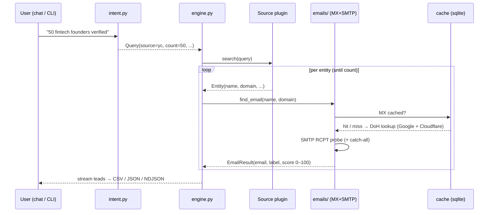

# Architecture

OpenLeads v3.0 is a small, readable Python package built around one idea:
**a universal deliverability engine fed by pluggable sources, that also writes and
sends.** The core library is 100% standard library (zero runtime dependencies) — the
verify engine, the SMTP sender, *and* the web server are all stdlib. The pretty chat
TUI and the LLM-drafting convenience live behind optional extras.

```
openleads/
├── cli.py            argparse front-end: find · run · write · send · sources · verify ·
│                       inbox · crm · config · doctor · web · cache · chat · campaign
├── chat.py           interactive REPL (rich/prompt_toolkit if installed, else stdlib)
├── intent.py         natural-language → Query (rule-based; optional free-LLM)
├── engine.py         the pipeline: Query → Source.search() → resolve → score → Lead
├── models.py         Entity · EmailResult · Lead · Query · Draft · SendResult (+ CSV schema)
├── settings.py       persistent, CLI/web-writable config + secret store (chmod 600)
├── config.py         ~/.openleads paths, optional env (OPENROUTER_API_KEY, GITHUB_TOKEN)
├── db.py             durable SQLite state: leads · touches · suppression · patterns
├── config_cmd.py     `openleads config` (interactive + set/get/list)
├── doctor.py         finding + sending health check (CLI text + JSON report())
├── writers.py        csv · json · ndjson output
├── ui.py             plain-text rendering (stdlib fallback for chat)
│
├── emails/           THE DELIVERABILITY ENGINE (vertical-agnostic) — 7 signals
│   ├── mx.py            multi-resolver DoH MX + SPF/DMARC/provider class
│   ├── permute.py      name → candidate local-parts
│   ├── patterns.py     learned per-domain patterns + global priors
│   ├── gravatar.py     existence signal (md5 → 200/404, no port 25)
│   ├── groundtruth.py  real emails from commits / mailto / security.txt
│   ├── smtp_verify.py  greylist-aware RCPT + catch-all double-probe (no DATA)
│   ├── score.py        pure fn: signals → score 0–100 + tier (safe|risky|bad) + reasons
│   └── resolve.py      orchestration (find_email, verify_address)
│
├── sources/          PLUGGABLE DATA SOURCES (yc · github · npi · openalex · producthunt)
│   ├── base.py · __init__.py (registry; discovers built-ins + ~/.openleads/sources/*.py)
│   └── …
│
├── outreach/         THE SENDING ENGINE
│   ├── compose.py      LLM/template drafting + spam-lint + personalization
│   ├── providers.py    SMTP presets (gmail/workspace/outlook/zoho/custom) + app-pw
│   ├── deliverability.py  sender preflight (SPF/DKIM/DMARC) + warmup planner
│   ├── sender.py       throttled, suppression-aware send; List-Unsubscribe; logging
│   ├── sequences.py    multi-step follow-ups; stop-on-reply/bounce
│   └── inbox.py        optional IMAP read-back (replies + bounces)
│
├── automate/         LOCAL AUTOMATIONS
│   ├── pipeline.py     find → verify → write → send in one call (the four clicks)
│   ├── crm.py          local CRM views/exports over db.py
│   ├── dedupe.py       cross-run dedupe + do-not-contact
│   ├── scheduler.py    drip loop + cron/launchd snippet
│   └── templates.py    template library + A/B subjects
│
├── web/              LOCAL-FIRST DASHBOARD (stdlib only — no Node, no build)
│   ├── server.py       ThreadingHTTPServer on 127.0.0.1; static + JSON API; CSP
│   ├── api.py          handlers bridging to the engine (streaming NDJSON)
│   └── static/         pre-built SPA: index.html · styles.css · app.js
│
├── cache/store.py    sqlite3 cache: mx (7d) · verify (14d) · dataset (1d)
└── campaign.py       v2 cold-email companion ([campaign] extra)

lead_engine.py        v1 back-compat shim → openleads
automation.py         v1 back-compat shim → openleads.campaign
site/                 static marketing landing (GitHub Pages)
npm/                  npx/npm wrapper around the Python CLI
```

## Data flow



## Design principles

1. **Zero dependencies in the core.** Engine + library are stdlib only — easy to
   audit, trivial to run. Pretty TUI and sending are opt-in extras.
2. **One job per unit.** Sources discover; the email engine verifies; writers
   format; the cache remembers. Each is testable in isolation, mostly without
   the network.
3. **Inverted moat.** Coverage scales by adding sources, not by owning a
   database. The email engine is vertical-agnostic.
4. **Honest confidence.** Guesses are labeled as guesses and scored 0–100;
   domain-less records (e.g. NPI) are surfaced without faking emails.
5. **Polite by default.** Connection reuse, small delays, multi-resolver MX, and
   caching keep OpenLeads a good network citizen.

See [`how-it-works.md`](./how-it-works.md) for the email engine internals and
[`sources.md`](./sources.md) for adding a vertical.
