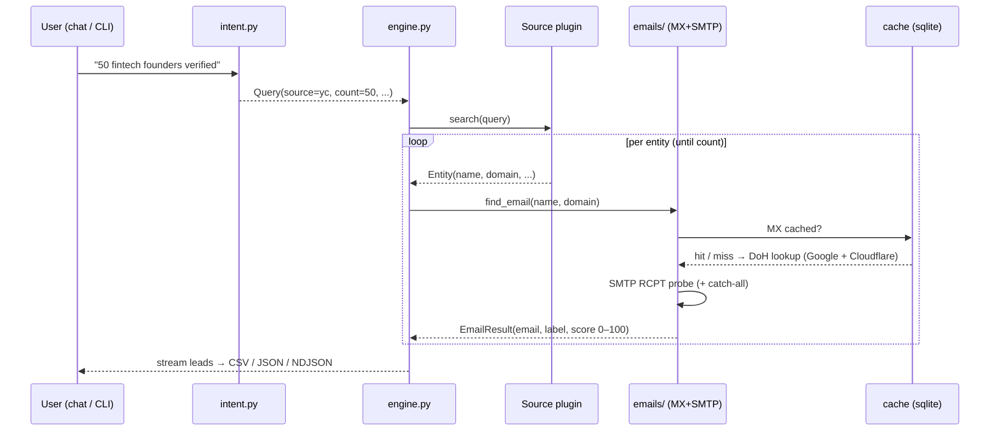

# Architecture

OpenLeads v2.0 is a small, readable Python package built around one idea:
**a universal email engine fed by pluggable sources.** The core library is
100% standard library (zero runtime dependencies); the pretty chat TUI and the
cold-email companion live behind optional extras.

```
openleads/
├── cli.py            argparse front-end: find · sources · verify · cache · chat · campaign
├── chat.py           interactive REPL (rich/prompt_toolkit if installed, else stdlib)
├── intent.py         natural-language → Query (rule-based; optional free-LLM)
├── engine.py         the pipeline: Query → Source.search() → resolve → score → Lead
├── models.py         Entity · EmailResult · Lead · Query · SourceInfo (+ CSV schema)
├── config.py         ~/.openleads paths, optional env (OPENROUTER_API_KEY, GITHUB_TOKEN)
├── writers.py        csv · json · ndjson output
├── ui.py             plain-text rendering (stdlib fallback for chat)
├── _http.py          tiny urllib helpers (dataset-cached)
│
├── emails/           THE EMAIL ENGINE (vertical-agnostic)
│   ├── mx.py            multi-resolver DoH MX lookup + agreement
│   ├── permute.py      name → candidate local-parts; role/disposable detection
│   ├── smtp_verify.py  one SMTP RCPT conversation, catch-all probe (no DATA)
│   └── resolve.py      orchestration + explainable 0–100 score
│
├── sources/          PLUGGABLE DATA SOURCES
│   ├── base.py         the Source contract
│   ├── __init__.py     registry: discovers built-ins + ~/.openleads/sources/*.py
│   ├── yc.py           startup founders (yc-oss)
│   ├── github.py       developers & orgs (keyless GitHub API)
│   ├── npi.py          U.S. doctors (NPI Registry)
│   ├── openalex.py     researchers (OpenAlex)
│   └── producthunt.py  trending products (public RSS)
│
├── cache/store.py    sqlite3 cache: mx (7d) · verify (14d) · dataset (1d)
└── campaign.py       optional cold-email companion ([campaign] extra)

lead_engine.py        v1 back-compat shim → openleads
automation.py         v1 back-compat shim → openleads.campaign
npm/                  npx/npm wrapper around the Python CLI
```

## Data flow



## Design principles

1. **Zero dependencies in the core.** Engine + library are stdlib only — easy to
   audit, trivial to run. Pretty TUI and sending are opt-in extras.
2. **One job per unit.** Sources discover; the email engine verifies; writers
   format; the cache remembers. Each is testable in isolation, mostly without
   the network.
3. **Inverted moat.** Coverage scales by adding sources, not by owning a
   database. The email engine is vertical-agnostic.
4. **Honest confidence.** Guesses are labeled as guesses and scored 0–100;
   domain-less records (e.g. NPI) are surfaced without faking emails.
5. **Polite by default.** Connection reuse, small delays, multi-resolver MX, and
   caching keep OpenLeads a good network citizen.

See [`how-it-works.md`](./how-it-works.md) for the email engine internals and
[`sources.md`](./sources.md) for adding a vertical.
